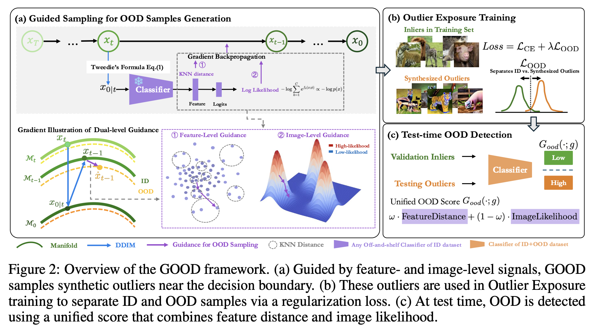

# GOOD: Training-Free Guided Diffusion Sampling for OOD Detection

Official implementation of **GOOD** — a training-free framework that leverages pretrained diffusion models and in-distribution classifiers to generate high-quality, diverse out-of-distribution (OOD) samples for improving OOD detection.

## Overview

GOOD uses dual-level guidance signals to steer diffusion sampling toward meaningful OOD regions:

- **Image-level (Energy) Guidance**: Uses the classifier's log-sum-exp energy to push samples toward low-density regions of the ID distribution in pixel space.
- **Feature-level (KNN) Guidance**: Uses k-nearest-neighbour distances in the classifier's feature space to push samples toward feature-sparse regions, improving diversity.

The generated OOD samples are then used for Outlier Exposure (OE) fine-tuning. A unified OOD scoring function adaptively fuses energy and KNN signals for robust detection.

<p align="center">
  
</p>

## Installation

```bash
git clone https://github.com/your-username/GOOD.git
cd GOOD
pip install -r requirements.txt
```

## Project Structure

```
GOOD/
├── generation/          # OOD sample generation via guided diffusion
│   ├── generate.py      # Main generation script
│   ├── diffusion/       # Stable Diffusion sampler
│   ├── guidance/        # Energy guidance, KNN guidance, TFG method
│   └── utils/           # Configs, prompt mappings
├── models/              # ResNet, ViT, ConvNeXt model definitions
├── classification/      # ID classifier training & feature extraction
├── detection/           # OE fine-tuning & OOD evaluation
├── datasets/            # Dataset loaders for generated images
├── utils/               # Scoring functions & metrics
└── configs/             # Example shell scripts for all stages
```

## Pipeline

The full pipeline consists of four stages:

### 1. Train an ID Classifier

```bash
bash configs/train_classifier_in100.sh    # ImageNet-100
bash configs/train_classifier_cifar100.sh  # CIFAR-100
```

### 2. Extract Features for KNN Guidance

```bash
python -m classification.extract_features \
    --dataset imagenet100 --data_root ./data \
    --model_arch resnet34 --num_classes 100 \
    --checkpoint checkpoints/classification/imagenet100_resnet34_224.pt \
    --cache_dir ./cache
```

### 3. Generate OOD Samples with GOOD

```bash
# Energy-guided generation
bash configs/generate_energy_in100.sh

# KNN-guided generation
bash configs/generate_knn_in100.sh

# Combined (dual-level) guidance
python -m generation.generate \
    --task image_energy+image_knn \
    --guide_network resnet34+resnet34 \
    --target OOD+OOD \
    ...
```

### 4. OE Fine-tuning & Evaluation

```bash
# Fine-tune with GOOD samples
bash configs/train_ood_detector_in100.sh

# Evaluate
bash configs/eval_ood_in100.sh
```

## Key Hyperparameters

| Parameter | Description | Default |
|-----------|-------------|---------|
| `--rho` | TFG x_t guidance weight | 0.5 (energy) / 1.0 (knn) |
| `--mu` | TFG x_0 guidance weight | 0.5 (energy) / 1.0 (knn) |
| `--sigma` | MC noise std | 0.1 (energy) / 0.001 (knn) |
| `--K` | KNN neighbors | 100 |
| `--a` | Adaptive weight parameter for unified scoring | 0.5 |
| `--energy_weight` | Lambda for OE energy regularisation | 1.0 |

## Acknowledgements

This work builds upon the [Training-Free Guidance (TFG)](https://github.com/YWolfeee/Training-Free-Guidance) framework. We thank the authors for their excellent codebase.

## Citation

```bibtex
@article{gao2026good,
  title={Good: Training-free guided diffusion sampling for out-of-distribution detection},
  author={Gao, Xin and Liu, Jiyao and Li, Guanghao and Lyu, Yueming and Gao, Jianxiong and Yu, Weichen and Xu, Ningsheng and Wang, Liang and Shan, Caifeng and Liu, Ziwei and others},
  journal={Advances in Neural Information Processing Systems},
  volume={38},
  pages={12325--12359},
  year={2026}
}
```

## License

This project is released under the MIT License.
